<!DOCTYPE html>
<html lang="es">
<head>
    <meta charset="UTF-8" />
    <meta name="viewport" content="width=device-width, initial-scale=1.0" />
    <title>Mina Malabrigo – Línea de Tiempo</title>
    
    
    
</head>
<body>
    <header>
        <h1>COMPAÑÍA RICO MORA S.C.S.</h1>
        <h2>Proyecto Mina Malabrigo – Línea de Tiempo del Trámite Ambiental y Minero</h2>
    </header>

    

        <h3>Resumen Ejecutivo</h3>
        

            Este sitio presenta una línea de tiempo profesional y estructurada del proceso minero y ambiental
            relacionado con el proyecto <strong>Mina Malabrigo</strong>, bajo el contrato de concesión
            <strong>IH8‑10541</strong>. Incluye hitos clave desde 2009 hasta 2024, actos administrativos,
            radicados, solicitudes, informes técnicos y seguimiento ambiental.

```mermaid
timeline
    title Línea de Tiempo Mina Malabrigo – COMPAÑÍA RICO MORA S.C.S.
    2009-08-12 : Contrato de concesión IH8-10541
    2015-07-28 : Suspensión de obligaciones – Resolución S201500290273
    2016-08-14 : Registro de suspensión en Registro Minero
    2020-02-27 : Solicitud de licencia ambiental
    2020-04-14 : Requerimientos FUR – ampliación de plazo
    2020-07-08 : Complemento del Estudio de Impacto Ambiental – EIA
    2020-09-03 : Informe técnico de evaluación EIA
    2020-09-09 : Negación de la licencia ambiental
    2020-10-01 : Reposición presentada
    2020-10-15 : Nuevos requerimientos técnicos
    2021-05-10 : Memorando inversión 1%
    2021-05-26 : Retroceso del trámite – revocatoria
    2021-06-04 : Solicitud única de información complementaria
    2021-08-12 : Entrega de información complementaria
    2021-10-13 : Adición de materiales al contrato IH8-10541
    2021-10-28 : Información completa para decisión
    2021-10-29 : Otorgada la Licencia Ambiental
    2022-08-26 : Solicitud de inscripción RUA
    2022-10-26 : ICA No. 1
    2022-11-15 : Respuesta de requerimientos
    2022-12-07 : Informe Técnico – oportunidades de mejora
    2022-12-27 : Acto ADM2212-11629
    2023-01-31 : Autodeclaración TUA 2022
    2023-02-08 : Objeción a volúmenes TUA
    2023-04-10 : Respuesta parcial
    2023-06-01 : Informe seguimiento 2022
    2023-06-09 : PMIRS
    2023-08-24 : Seguimiento ene–jun 2023
    2023-10-25 : Informe técnico tras visita
    2023-11-17 : Acto ADM2311-10806
    2024-03-20 : Respuesta parcial al acto
```
        

        <h3>Línea de Tiempo – Diagrama Profesional</h3>
        

        

        <h3>Tabla Detallada de Eventos</h3>
        
A continuación, se presenta la tabla completa con todos los hitos suministrados:

        <table>
            <tr>
                <th>Fecha</th>
                <th>Categoría</th>
                <th>Descripción</th>
                <th>Radicado / Referencia</th>
            </tr>
            <!-- Las filas se añadirán luego si deseas que las convierta todas -->
        </table>

    

    <footer>
        COMPAÑÍA RICO MORA S.C.S. • Línea de Tiempo Mina Malabrigo • Página generada automáticamente
    </footer>
</body>
</html>
